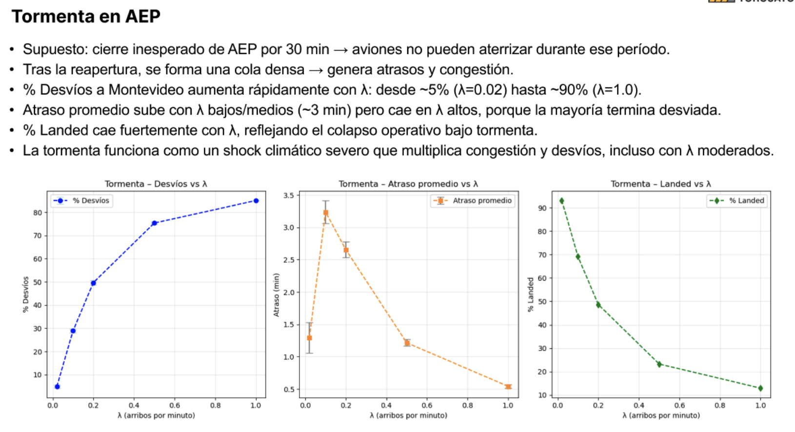
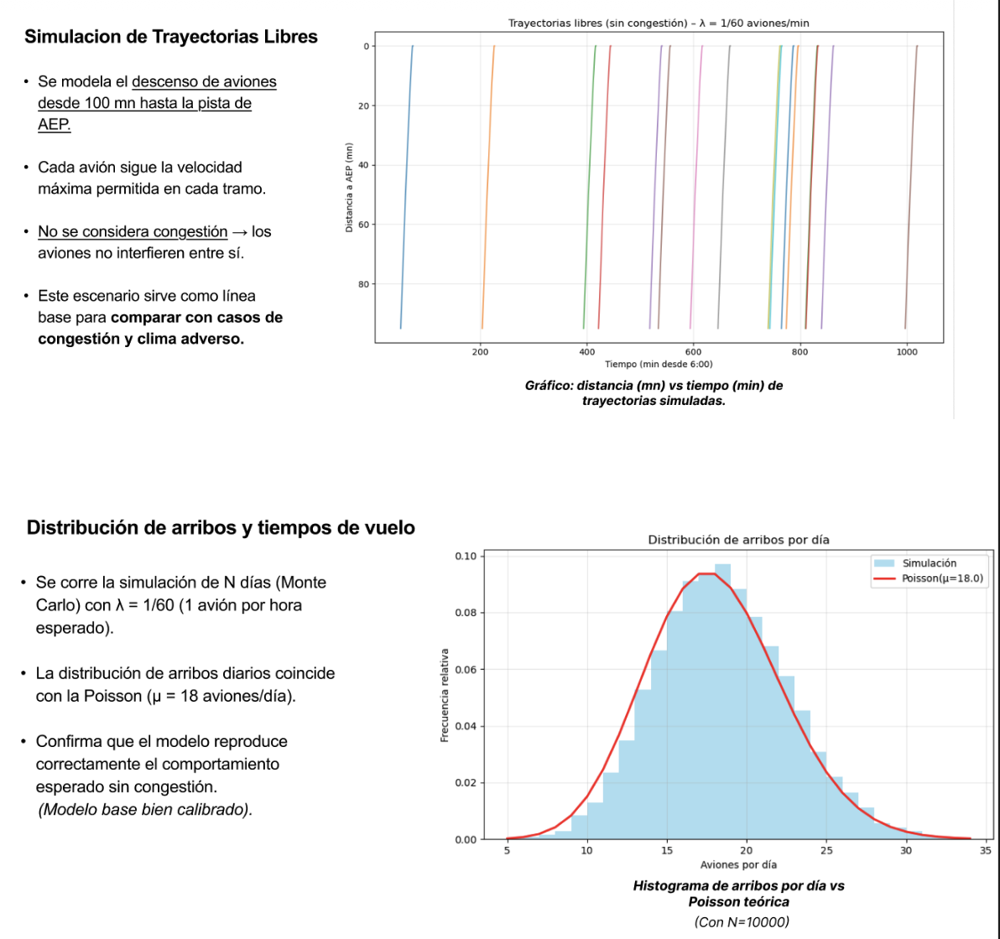

# Airport Operations Simulation

Discrete-event simulation of airport operations, landing queues, congestion scenarios and operational disruptions using Python and Monte Carlo methods.

## Features

- Aircraft arrival simulation
- Landing queue and runway separation rules
- Congestion and delay analysis
- Wind and storm disruption scenarios
- Monte Carlo experiments
- Animated congestion simulation

## Technologies

Python · NumPy · Matplotlib · Jupyter Notebook · Monte Carlo Simulation · Queueing Theory

## Simulation Demo

See `congestion_simulation_demo.mp4`.

## Results

- Congestion analysis under different traffic conditions
- Queue growth and delay metrics
- Operational performance evaluation through Monte Carlo simulations

## Simulation Results

## Traffic Distribution Analysis

